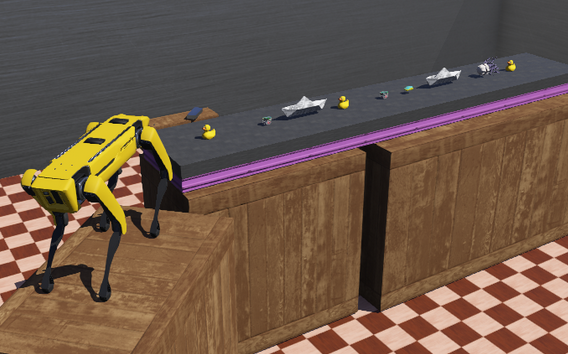
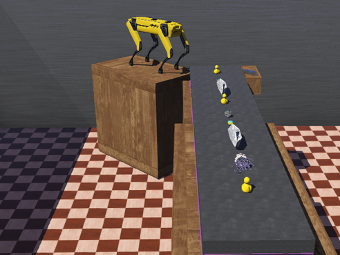
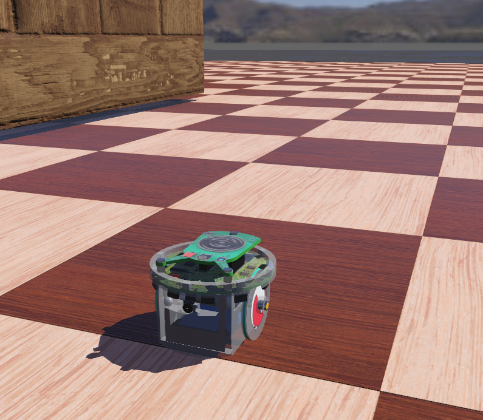
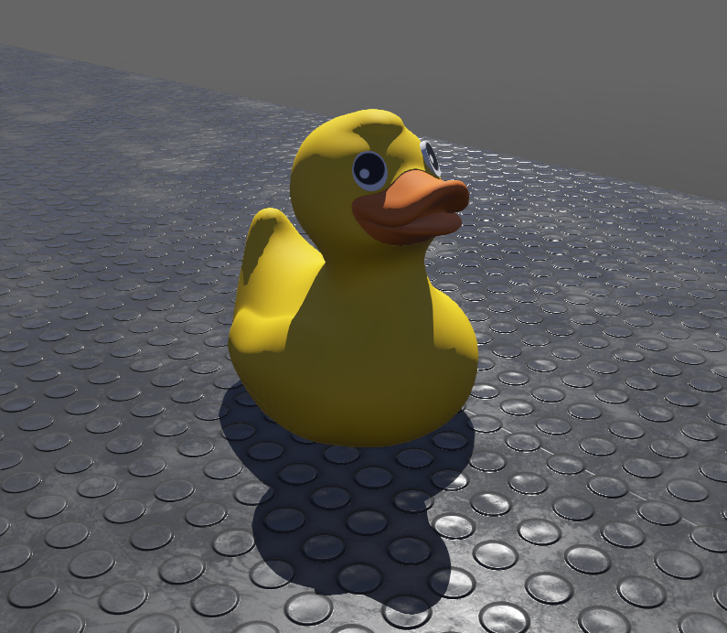
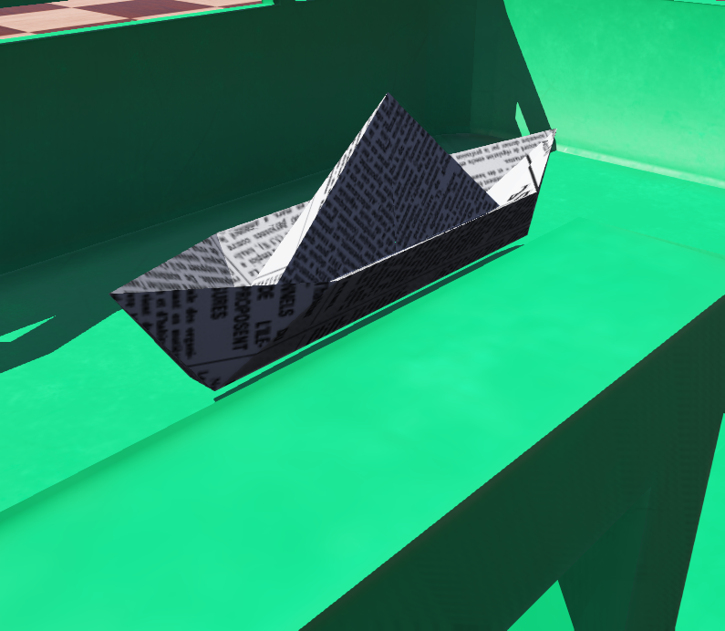

#All the codes are on the master branch.

# ME536_Project

This project detects 3 toys from the conveyor belt using cnn, and classify the unknown objects on the belts as safe or dangerous. The webots simulation environment is used for this purpose.

All the codes are on the master branch.

Transfer learning is used with ResNet50 model. controllers/get_img/cnn4.py file is used for training the model.

The datasets for training, validation and test are in controllers/get_img/cnn folder.

The model is the controllers/get_img/cnn/model/model.pth file.

